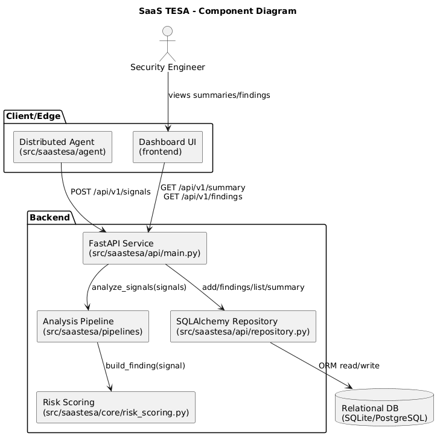
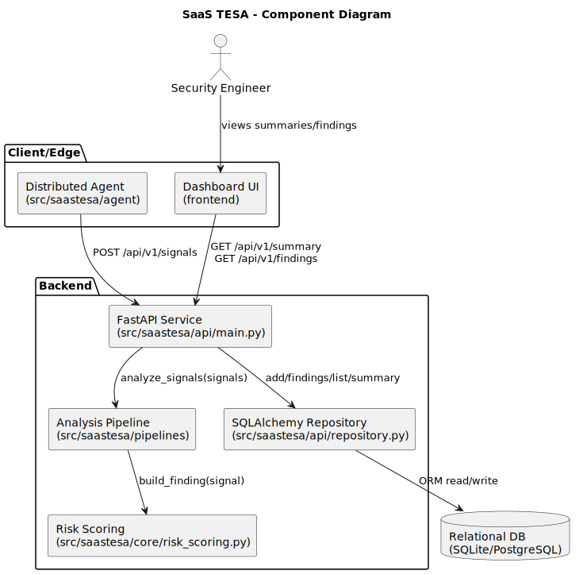
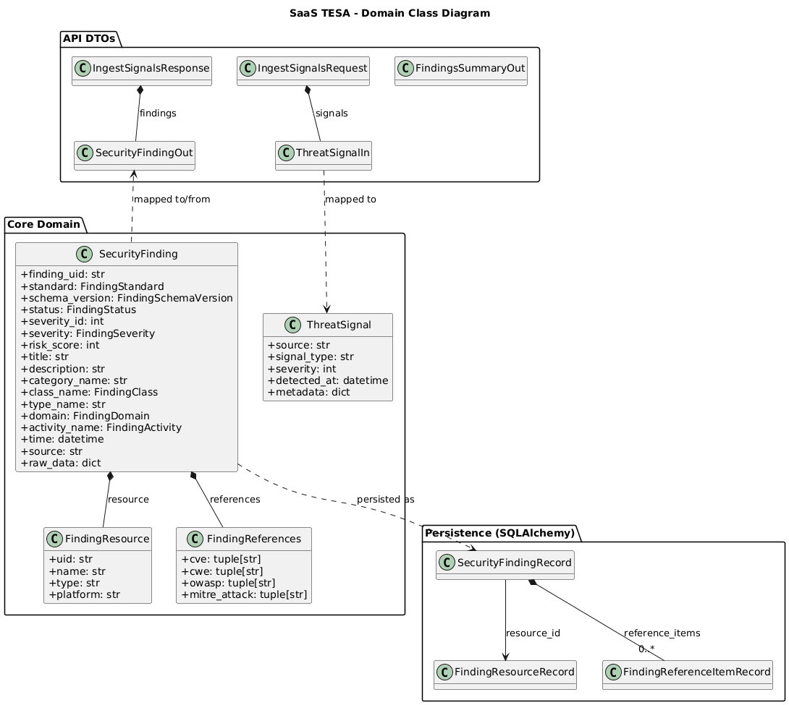
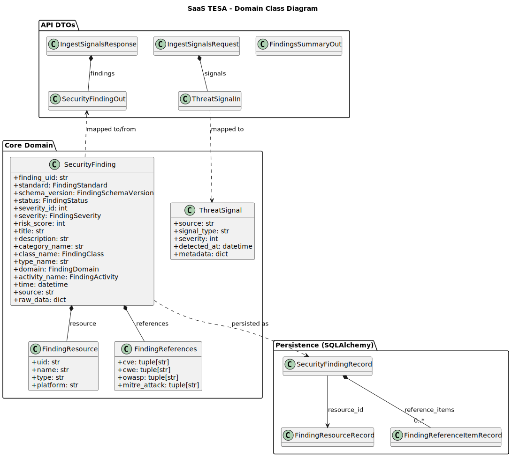
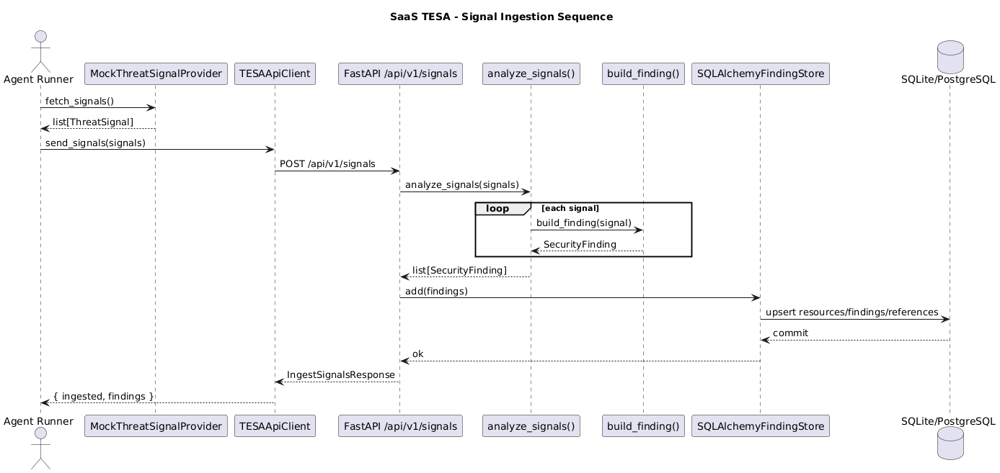
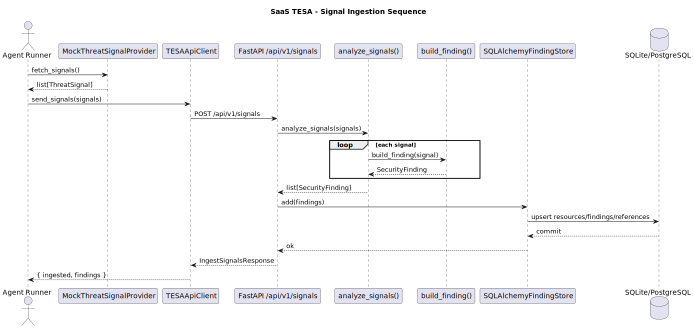
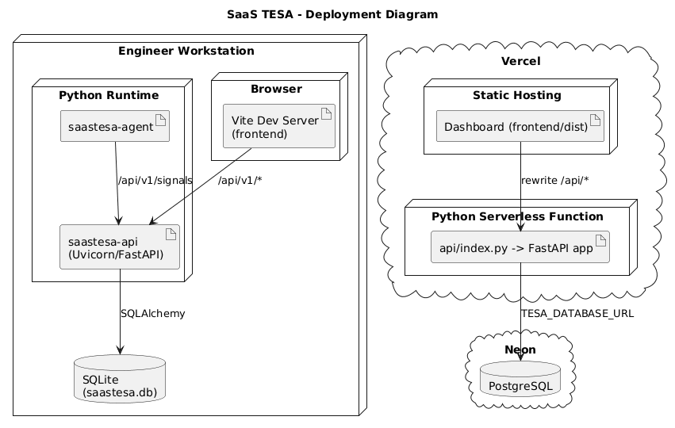
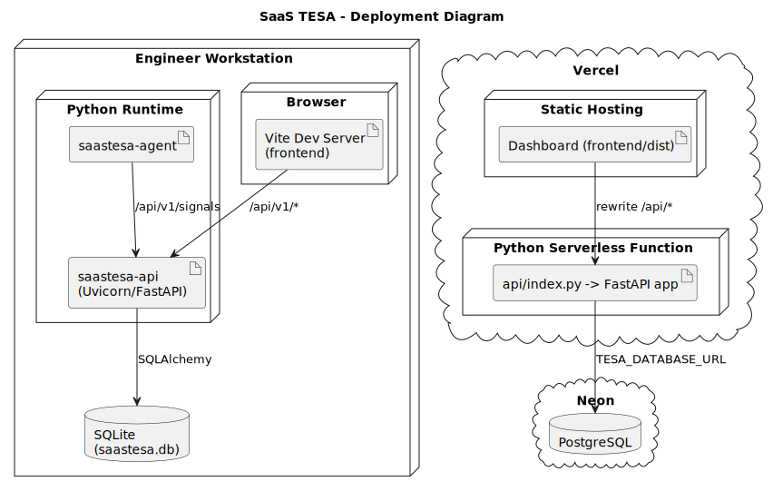

# UML Diagrams (PlantUML)

This folder contains typical UML diagrams for the SaaS TESA project.

## Diagrams

- [Component Diagram source](component-diagram.puml) | [SVG](images/component-diagram.svg) | [PNG](images/component-diagram.png)
- [Domain Class Diagram source](domain-class-diagram.puml) | [SVG](images/domain-class-diagram.svg) | [PNG](images/domain-class-diagram.png)
- [Ingestion Sequence Diagram source](ingestion-sequence-diagram.puml) | [SVG](images/ingestion-sequence-diagram.svg) | [PNG](images/ingestion-sequence-diagram.png)
- [Deployment Diagram source](deployment-diagram.puml) | [SVG](images/deployment-diagram.svg) | [PNG](images/deployment-diagram.png)

## Previews

### Component Diagram





### Domain Class Diagram





### Ingestion Sequence Diagram





### Deployment Diagram





## Render options

- VS Code: install a PlantUML extension and open any `.puml` file.
- CLI with Docker:

  ```bash
  docker run --rm -v "$PWD":/work -w /work plantuml/plantuml docs/uml/*.puml
  ```

- Local Java install:

  ```bash
  plantuml docs/uml/*.puml
  ```
